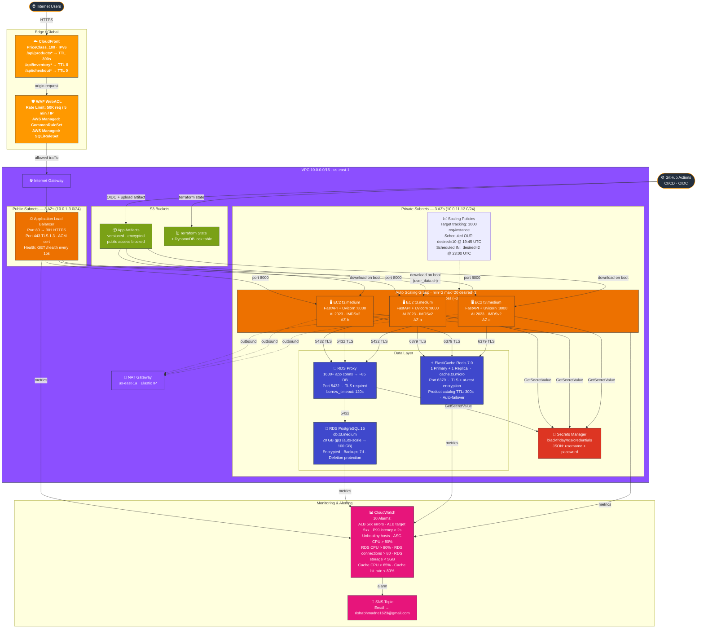

# BlackFriday-Ready Infrastructure — Architecture Diagram

## Request Flow

| Step | Path | Notes |
|------|------|-------|
| 1 | Users → CloudFront | TLS at edge, geo-distributed |
| 2 | CloudFront → WAF | Rate limit + OWASP rule enforcement |
| 3 | WAF → ALB | Only allowed traffic reaches VPC |
| 4 | ALB → EC2 (ASG) | Round-robin across 2–20 instances |
| 5 | EC2 → RDS Proxy → RDS | Connection multiplexing, TLS, Secrets Manager auth |
| 6 | EC2 → ElastiCache Redis | Product catalog cached 300s; inventory/checkout bypass |
| 7 | Metrics → CloudWatch → SNS | 10 alarms, email notification on breach |

## Caching Strategy

| Path | CloudFront TTL | Redis TTL | Notes |
|------|---------------|-----------|-------|
| `/api/products*` | 300s | 300s | Two-layer cache |
| `/api/inventory*` | 0 (bypass) | — | Always real-time |
| `/api/checkout*` | 0 (bypass) | — | Always real-time |

## Scaling Configuration

| Trigger | Action |
|---------|--------|
| ALB requests > 1000/instance | Target tracking scale-out |
| Daily 19:45 UTC | Pre-scale to 10 instances (Black Friday peak) |
| Daily 23:00 UTC | Scale-in to 2 instances |
| Warm pool | 3 stopped instances → online in ~30s |
